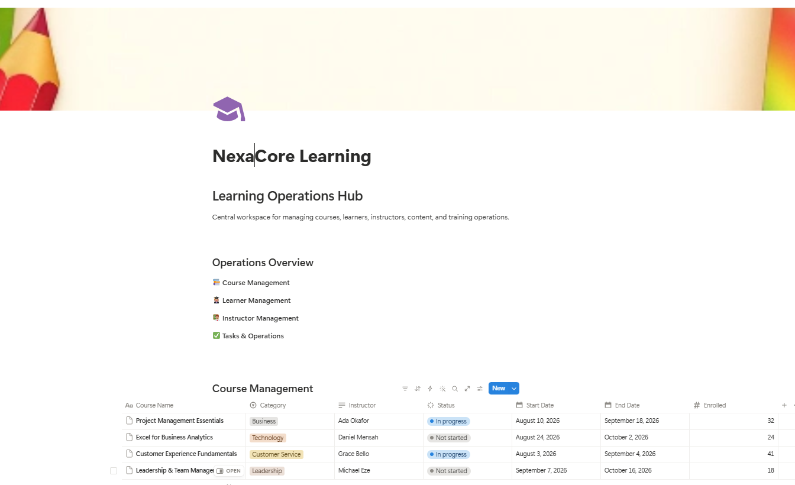
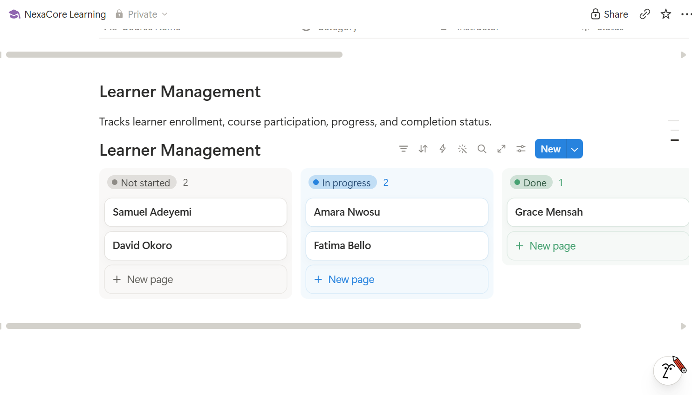
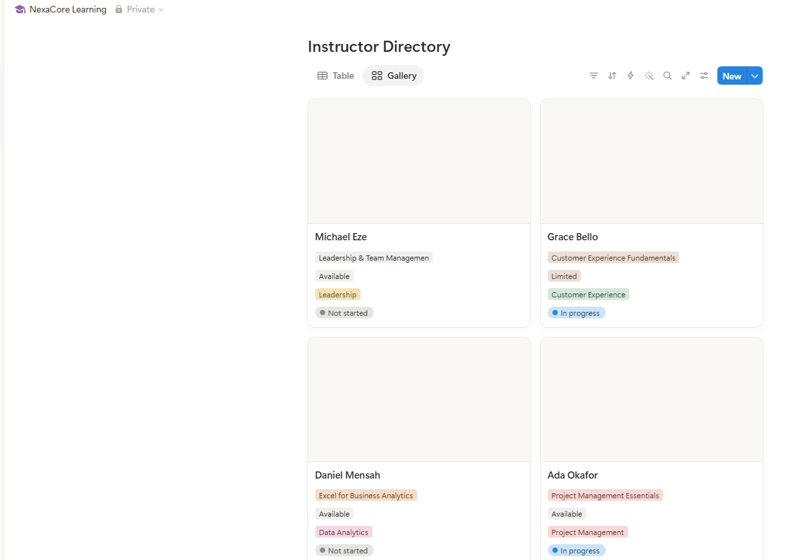
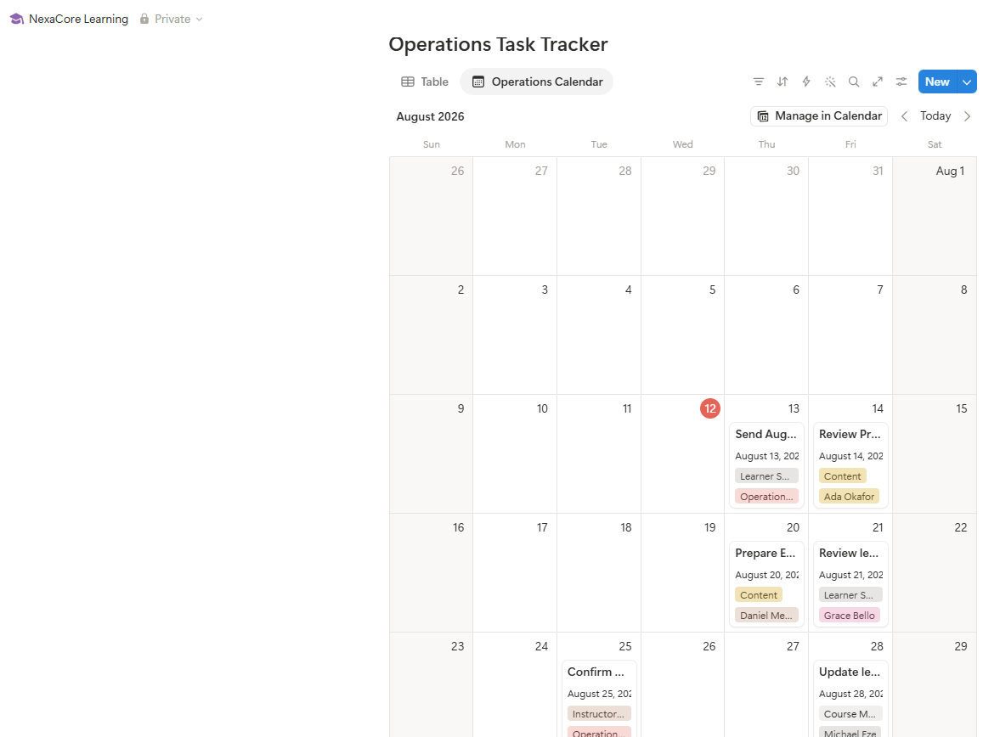
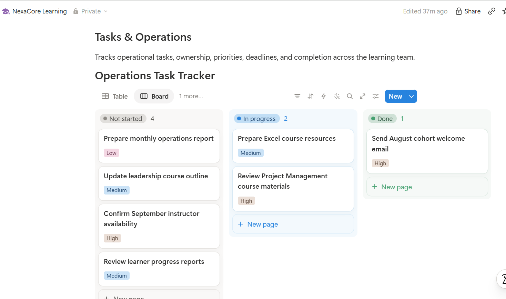
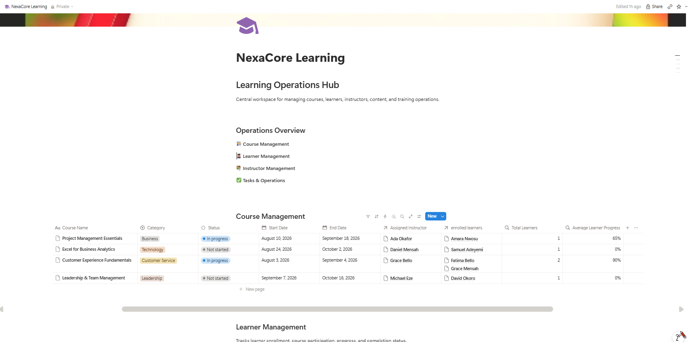
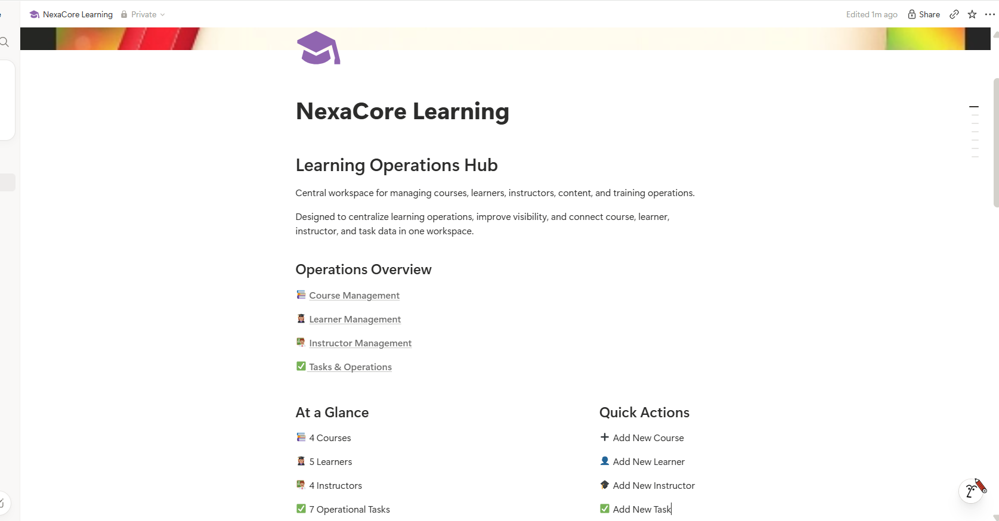

# 🎓 NexaCore Learning
## Notion Learning Operations Hub

A structured learning operations workspace built in **Notion** to centralize course management, learner tracking, instructor coordination, operational tasks, scheduling, and progress reporting.

This implementation demonstrates how Notion can be configured as an interconnected operational system rather than simply a collection of pages.

---

## 🌐 Live Portfolio

Explore the live NexaCore Learning workspace in Notion:

👉 **(https://app.notion.com/p/NexaCore-Learning-3ba0edc6455480949949f3b3fa570408?source=copy_link)**

> The live workspace provides an interactive view of the course management, learner tracking, instructor management, task operations, database relations, rollups, and dashboard structure demonstrated in this repository.

---

## 📌 Project Overview

NexaCore Learning was built as a centralized workspace for managing the operational side of a learning and training environment.

The system brings together four core operational areas:

- 📚 Course Management
- 🧑‍🎓 Learner Management
- 🧑‍🏫 Instructor Management
- ✅ Tasks & Operations

Instead of maintaining these areas separately, the workspace uses structured databases, multiple views, relations, and rollups to connect information across the system.

---

# 🏠 Learning Operations Dashboard

The main dashboard acts as the central entry point into the workspace, providing quick access to the major operational areas while keeping course information visible from one location.

<p align="center">
  
</p>

<p align="center">
  <sub><b>Learning Operations Dashboard</b> — Centralized navigation and course management workspace</sub>
</p>

The dashboard was designed to make the workspace easy to navigate while keeping important operational information accessible from a single hub.

---

## 🧱 Workspace Architecture

```text
NexaCore Learning
│
├── 📚 Course Management
│   ├── Course Details
│   ├── Categories
│   ├── Course Status
│   ├── Start & End Dates
│   ├── Assigned Instructors
│   ├── Enrolled Learners
│   └── Progress Rollups
│
├── 🧑‍🎓 Learner Management
│   ├── Learner Records
│   ├── Course Enrollment
│   ├── Progress Tracking
│   └── Completion Status
│
├── 🧑‍🏫 Instructor Management
│   ├── Instructor Directory
│   ├── Course Assignment
│   ├── Availability
│   ├── Expertise
│   └── Status
│
└── ✅ Tasks & Operations
    ├── Operational Tasks
    ├── Ownership
    ├── Priority
    ├── Deadlines
    ├── Status Tracking
    └── Calendar Planning
```

---

# 👥 People Management

Learners and instructors are managed through dedicated databases, providing structured visibility into course participation, progress, instructor assignments, expertise, and availability.

<table>
  <tr>
    <td width="50%" align="center">
      
      <br><br>
      <sub><b>Learner Management</b><br>Progress tracking by status</sub>
    </td>
    <td width="50%" align="center">
      
      <br><br>
      <sub><b>Instructor Directory</b><br>Course assignment and availability</sub>
    </td>
  </tr>
</table>

## 🧑‍🎓 Learner Management

The Learner Management database provides a structured way to monitor participation and completion.

Learners can be grouped according to their current status:

- **Not started**
- **In progress**
- **Done**

This makes it easy to identify learners who have not begun their training, those currently participating, and those who have completed their assigned learning activities.

Learner records are also connected to courses, allowing enrollment and progress information to support course-level reporting.

## 🧑‍🏫 Instructor Management

The Instructor Directory centralizes information about the instructors responsible for course delivery.

Instructor records include operational information such as:

- Assigned Course
- Availability
- Area of Expertise
- Current Status

A gallery view provides a visual directory while the underlying database maintains structured instructor information.

---

# ⚙️ Tasks & Operations

Operational work is managed through a dedicated task database.

Rather than creating separate systems for schedules and workflow tracking, the same operational data can be viewed in multiple ways.

<table>
  <tr>
    <td width="50%" align="center">
      
      <br><br>
      <sub><b>Calendar View</b><br>Deadlines and operational scheduling</sub>
    </td>
    <td width="50%" align="center">
      
      <br><br>
      <sub><b>Board View</b><br>Workflow and status tracking</sub>
    </td>
  </tr>
</table>

## 📅 Calendar View

The calendar transforms task deadlines into a visual operational schedule.

Tasks such as course preparation, learner communication, instructor coordination, reporting, and content reviews can be scheduled and monitored directly from the workspace.

This gives the learning team a clearer picture of upcoming operational commitments.

## ✅ Status Board

The same task database can be viewed as a workflow board and grouped by status:

| Status | Purpose |
|---|---|
| ⚪ Not started | Work waiting to begin |
| 🔵 In progress | Work currently being handled |
| 🟢 Done | Completed operational work |

Priority indicators provide an additional layer of visibility so important work can be identified quickly.

The calendar and board therefore provide two operational perspectives without duplicating task information.

---

# 🔗 Relations & Rollups

A major part of the implementation was connecting the databases rather than allowing each area to operate independently.

The Course Management database was connected to learner and instructor records using **Notion Relations**.

Rollups were then used to surface useful information from those connected records.

<p align="center">
  
</p>

<p align="center">
  <sub><b>Connected Course Management</b> — Relations and rollups connecting instructors, learners and progress data</sub>
</p>

A course record can therefore surface information such as:

- Assigned Instructor
- Enrolled Learners
- Total Learners
- Average Learner Progress

This creates a relational workspace where information entered in one part of the system supports visibility elsewhere.

### Example Data Flow

```text
Instructor Directory
        │
        ▼
   Assigned Course
        │
        ▼
Course Management
        │
        ├──────────────► Enrolled Learners
        │
        ▼
 Learner Management
        │
        ▼
 Learner Progress
        │
        ▼
Course Progress Rollup
```

---

# 📊 Final Learning Operations Hub

The completed dashboard brings the major components of the workspace together into a cleaner operational interface.

<p align="center">
  
</p>

<p align="center">
  <sub><b>Final NexaCore Learning Operations Hub</b> — Central navigation, operational summary and quick actions</sub>
</p>

The final dashboard includes three key areas:

### 🧭 Operations Overview

Direct navigation to:

- Course Management
- Learner Management
- Instructor Management
- Tasks & Operations

### 📊 At a Glance

A compact operational summary showing key workspace information, including:

- 4 Courses
- 5 Learners
- 4 Instructors
- 7 Operational Tasks
- Courses in Progress

### ⚡ Quick Actions

Frequently used actions are surfaced directly on the dashboard:

- Add New Course
- Add New Learner
- Add New Instructor
- Add New Task

This reduces unnecessary navigation and makes the workspace easier to use during day-to-day learning operations.

---

# 🛠️ Notion Features Implemented

| Feature | Implementation |
|---|---|
| Databases | Structured operational data management |
| Table Views | Detailed course and operational records |
| Board Views | Learner and task status tracking |
| Gallery View | Instructor directory |
| Calendar View | Deadline and operational scheduling |
| Select Properties | Categories, availability and priorities |
| Status Properties | Workflow and progress tracking |
| Date Properties | Course schedules and task deadlines |
| Relations | Connected course, learner and instructor records |
| Rollups | Learner counts and progress summaries |
| Linked Views | Multiple operational views of shared data |
| Dashboard | Centralized workspace navigation |
| Quick Actions | Faster access to common operational activities |

---

# 🧠 Implementation Approach

The workspace was developed in stages:

### 1. Workspace Planning
The major operational areas required for learning management were identified.

### 2. Database Development
Structured databases were created for courses, learners, instructors, and operational tasks.

### 3. Property Configuration
Each database was configured with properties appropriate to its operational purpose.

### 4. View Configuration
Table, board, gallery, and calendar views were created to present information in different operational formats.

### 5. Database Relationships
Relations were created to connect courses with instructors and learners.

### 6. Rollup Configuration
Rollups were configured to summarize related information such as learner counts and average learner progress.

### 7. Dashboard Development
The individual operational components were brought together into the NexaCore Learning Operations Hub.

### 8. Workspace Refinement
Navigation, quick actions, summary information, and visual organization were refined to produce the final workspace.

---

# 📂 Repository Structure

```text
nexacore-learning-notion-operations-hub/
│
├── README.md
│
├── docs/
│   ├── 01-project-overview.md
│   ├── 02-workspace-architecture.md
│   ├── 03-database-design.md
│   ├── 04-relations-and-rollups.md
│   ├── 05-views-and-workflows.md
│   └── 06-implementation-summary.md
│
└── screenshots/
    ├── 01-nexacore-learning-operations-dashboard.png
    ├── 02-learner-management-status-board.png
    ├── 03-instructor-management-gallery.png
    ├── 04-operations-task-calendar.png
    ├── 05-operations-task-status-board.png
    ├── 06-course-relations-and-rollups.png
    └── 07-nexacore-learning-final-dashboard.png
```

---

# 📖 Documentation

Detailed implementation documentation is available in the `docs` folder.

| Document | Description |
|---|---|
| `01-project-overview.md` | Project purpose, objectives and scope |
| `02-workspace-architecture.md` | Structure of the Notion workspace |
| `03-database-design.md` | Database properties and configuration |
| `04-relations-and-rollups.md` | Connected database architecture |
| `05-views-and-workflows.md` | Table, board, gallery and calendar workflows |
| `06-implementation-summary.md` | Summary of the completed implementation |

---

# 💼 Skills Demonstrated

This project demonstrates hands-on experience with:

- Notion Workspace Design
- Notion Database Configuration
- Relational Database Design
- Relations & Rollups
- Dashboard Development
- Workflow Design
- Task Management
- Learning Operations
- Course Management
- Data Organization
- Operational Process Design
- Project Documentation

---

# 🎯 Project Outcome

The completed NexaCore Learning workspace provides a centralized operational environment where courses, learners, instructors, tasks, schedules, and progress information can be managed together.

The implementation demonstrates how Notion can support interconnected operational workflows through structured databases, relational data, multiple views, rollups, and a centralized dashboard.

---

## 👤 Portfolio Project

**Notion Learning Operations & Workflow Implementation**

---

## 🔗 Explore the Implementation

Want to see the workspace beyond the screenshots?

👉 **(https://app.notion.com/p/NexaCore-Learning-3ba0edc6455480949949f3b3fa570408?source=copy_link)**

---

## 🔗 Live Repository

Explore the complete project documentation, implementation screenshots, and workspace configuration on GitHub:

👉 **(https://github.com/cbmaduka/notion-learning-operations-implementation)**

---

## 👤 Portfolio Project

**Built by Chika Blessing**

**Notion Learning Operations & Workflow Implementation**

This repository documents the workspace structure, database configuration, connected records, operational views, workflow design, and final implementation.
